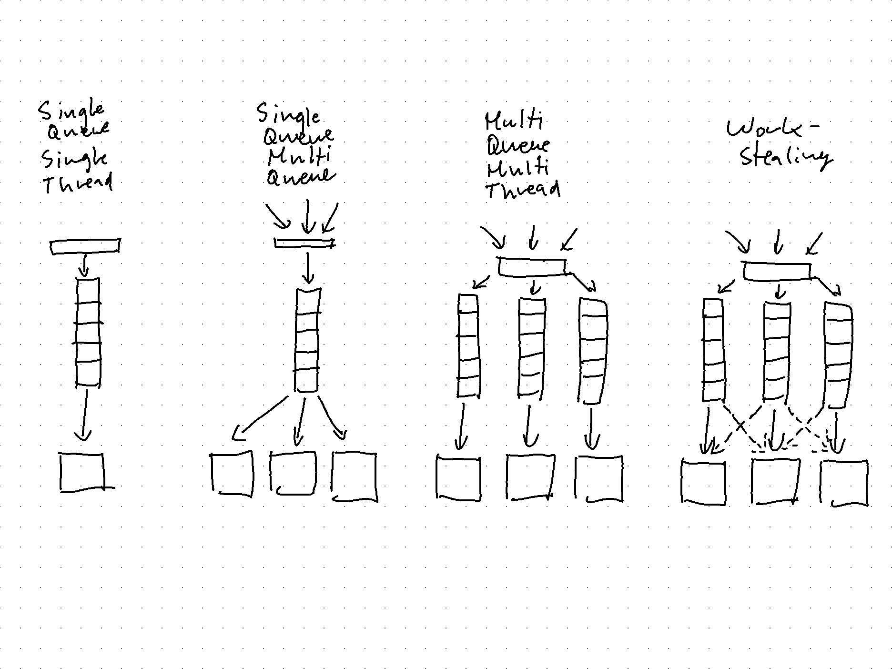
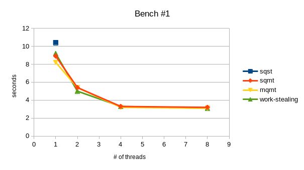
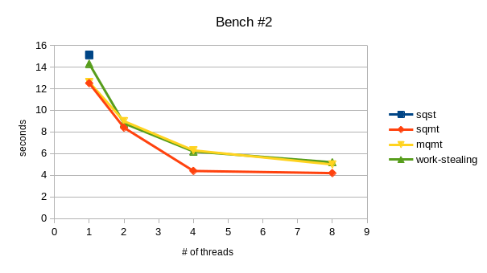
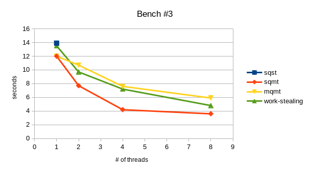

# Benchmarks for SE_24 Distributed and Parallel Computing

## What?

In this repository you can find 4 different implementations of a thread-pool and 3 different workloads. As you might guess, we run all of the workloads against all of the implementations. We repeat this with different amounts of threads (1, 2, 4, 8).

## Why?

The goal of this is to understand how different design decisions impact the performance under different workloads. The implementations are very similar overall but differ in the amount of queues and threads, and depending on that the usage or not-usage of mutexes. They are by no means optimized and should not end up in any production system. Below I will briefly describe them.

## How?

But first let us take a look how to run the benchmarks. The exact numbers will depend on your hardware, but how the different implementations relate to another should be similar.

1. Have [rust](https://www.rust-lang.org/tools/install) and [`drill`](https://github.com/fcsonline/drill#install) installed.
2. Adjust the number of threads in the constructor of the server. (TODO: make this configurable via cli-argument)
3. Start one of the servers.
    ```console
    $ cargo run --release --bin <BIN>
    ```
    BIN: sqst, sqmt, mqmt, work_stealing
4. Run the benchmark.
    ```console
    $ drill --benchmark bench/bench-<NUM>.yml --stats
    ```
    NUM: 1, 2, 3
5. Repeat! (goto `2.`)

### Implementations

Each implementation starts a simple tcp-server which accepts connections on `127.0.0.1:7878` and executes every request as a task on our thread-pool. The most time consuming part is running a recursive fibonacci function, with the input taken from the route. E.g. `GET /4` will run `fibonacci(4)`.



In the visualization above you can see the structure of the 4 different implementations.

The single-queue-single-thread (`sqst`) is the most simple. It has one queue into which all the tasks get pushed and one thread executing the tasks in the queue. Because of its simplicity there is no need for a `Mutex` and no contention on the queue.

The single-queue-multi-thread (`sqmt`) has still only one queue but multiple threads pulling tasks out of the queue in order to execute them. The queue is highly contended and therefore synchronized via a `Mutex`.

The multi-queue-multi-thread (`mqmt`) has multiple queues, namely one for each thread. Tasks get inserted into the queues in a round robin fashin and each thread pulls out of its dedicated queue. There is no contention on the queues and therefore no `Mutex` needed.

The work-stealing has multiple queues, similarly to `mqmt` one for each thread. While each thread still has their personal queue, they steal tasks from other queues, if no task is available in their own queue. Each queue has potential contention and therefore is synchronized via a `Mutex`.

### Workloads

The different workloads are described in the yml-files in `bench/`. `drill` will send as many requests as specified by `iterations`, with a concurrency specified by `concurrency`.

`bench-1.yml` only sends `GET /6`, therefore all the tasks take the same time for processing.

`bench-2.yml` sends `GET /4`, `GET /5`, `GET /6`, `GET /7`. The tasks take different times for processing but are relatively evenly distributed.

`bench-3.yml` sends `GET /1` and `GET /8` but for every `GET /8` there are 9 `GET /1`. In other words we have many small and very few very big tasks.

## Analysis

You can find the results in [./bench/bench.csv](./bench/bench.csv) and a visualization of them here:


*Results of `bench-1`.*


*Results of `bench-2`.*


*Results of `bench-3`.*

**Observations** (some might be obvious)
- performance improves when increasing the number of threads, but not linearly
- unexpectedly sqmt has the best performance in most cases -> this probably is to some inefficiency in the implementation of mqmt and work-stealing
- also unexpectedly sqst has significantly worse performance than sqmt with one thread. I would have assumed this to be the other way around, because in sqmt the queue is inside a vector and protected by a mutex which should create some overhead, but apparently rather creates a speedup
